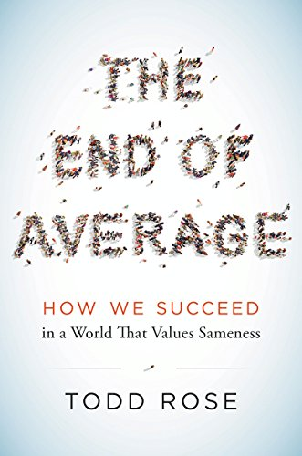

```{r, echo = FALSE, message = FALSE, warning = FALSE}
# R options
options(
  htmltools.dir.version = FALSE,
  tibble.width = 65,
  width = 65
  )

# figure height, width, dpi
knitr::opts_chunk$set(fig.width = 8, 
                      fig.asp = 0.618,
                      out.width = "60%",
                      dpi = 300)

# fontawesome
htmltools::tagList(rmarkdown::html_dependency_font_awesome())

# magick
dev.off <- function(){
  invisible(grDevices::dev.off())
}

# xaringanExtra
library(xaringanExtra)
xaringanExtra::use_panelset()

library(tidyverse)
library(kableExtra)
```

```{r set-theme, include = FALSE}
library(xaringanthemer)
style_duo_accent(
  primary_color      = "#b76352", # mango
  secondary_color    = "#34605f", # bayberry
  header_font_google = google_font("Raleway"),
  text_font_google   = google_font("Raleway", "300", "300i"),
  code_font_google   = google_font("Source Code Pro"),
  header_color = "#793540", #rhubarb
  white_color = "#F5F5F5", # lightest color
  black_color = "#36454F", # darkest color
  text_font_size = "30px", 
  link_color = "#696969" #grey
)
```


class: center, middle

.larger[**Suppose...**]

--

.large["Overall this instructor was educationally effective."]

.pull-left[
```{r, echo = FALSE}
evals <- tibble(
  year = c(rep(2020, 2), 
           rep(2021, 5)
           ), 
  quarter = c(rep("Fall", 2), 
              rep("Winter", 2), 
              rep("Spring", 3)
              ), 
  average = c(4.53, 4.36, 
              4.18, 4.24, 
              4.83, 4.41, 4)
)

kable(evals) %>% 
  kable_styling(stripe_color = "light blue")

```
]

--

.pull-right[
</br> 

.large[What do these averages *mean*?]
]

---

.huge[The Problem]

.large[It’s incredibly rare for scientists, including statisticians, to explicitly
think about that conditions underlying their models.] 

<!-- Beyond “checking” higher level assumptions in a stale and automatic fashion.  -->

<!-- I had many conversations in very different contexts with scientists about what -->
<!-- the average calculated from the data (or mean in a model) could reasonably -->
<!-- represent and whether that was really what the scientist was after.  -->

---

.larger[Why so much resistance?]

</br> 
</br> 

- Departments hold specific expectations of statistics courses. 

- These expectations are conditional on the assumption that means represent 
**the** magic quantity of interest 


- I'm then expected to educate you to "play the game" in the scientific 
culture of averages 


---

class: center, middle, inverse



---

class: center, middle, inverse

.larger[Averagarianism]

> The primary research method of averagarianism is aggregate, then analyze: 
> First, combine many people together and look for patterns in the group. Then,
> use these group patterns (such as averages and other statistics) to analyze
> and model individuals. The science of the individual instead instructs
> scientists to analyze, then aggregate: First, look for pattern within each
> individual. Then, look for ways to combine these individual patterns into
> collective insight.

> *The End of Average*  Todd Rose

---

class: center, middle, inverse

.larger[What else then?]

> If you could not use averages to evaluate, model, and select individuals,
> well then...what could you use? 
>
> This practical retort underscores the reason that averagarianism has endured
> for so long and become so deeply ingrained throughout society.

---

.larger["We've always done it this way"]

</br>
</br> 

Methods based on averages are available, easy, convenient, and take little
creativity — and they are expected in our scientific culture. 

Justification for using averages is simply not demanded — though justification
for use of anything but averages is incredibly difficult to sell.

---

class: center, inverse

.larger[Some Rules to Play By]

</br> 

--

.large[Look at and understand your *raw* data *before* aggregating]

--

.large[Boxplots (and such) don't count as visualizing the *raw* data.]

--

.large[We should only average things we are convinced are measuring the same thing.]

